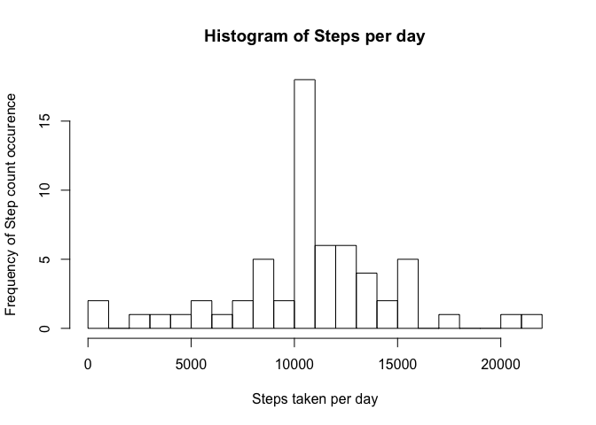
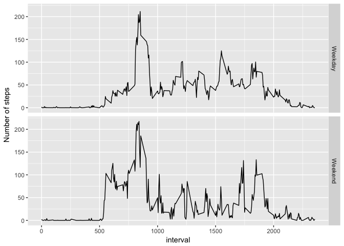

# Reproducible Research: Peer Assessment 1 by Matti Niemistö
## Assignment
Target for this assignment is to study the activity patterns of one individual wearing activity monitor. Goal is to understand how daily activity differs from day to day during the measurement period and practice Literate programming using R, R markdown and knitr.

## Let's start by loading needed libraries
We'll be using dplyr for data manipulation and ggplot2 for plotting so let's load these libraries.


```r
library(dplyr)
```

```
## Warning: package 'dplyr' was built under R version 3.4.1
```

```
## 
## Attaching package: 'dplyr'
```

```
## The following objects are masked from 'package:stats':
## 
##     filter, lag
```

```
## The following objects are masked from 'package:base':
## 
##     intersect, setdiff, setequal, union
```

```r
library(ggplot2)
```

## Loading and preprocessing the data
The initial step is to unzip the data and load the data in. 

```r
if(!file.exists("./data/activity.csv"))
  unzip("activity.zip", exdir = "data")
df <- read.csv("./data/activity.csv")
```

## Calculate the total number of steps each day
At this phase let's omit the NA values completely.

```r
total_steps <- df %>% group_by(date) %>% summarise(sum = sum(steps, na.rm = TRUE))
hist(total_steps$sum, breaks = 20, ylab = "Frequency of Step count occurence", xlab = "Steps taken per day", main = "Histogram of Steps per day")
```

<!-- -->

## What is mean total number of steps taken per day?
Ok, next let's calculate the mean and median values for steps taken within one day.


```r
mea <- mean(total_steps$sum)
med <- median(total_steps$sum)
data.frame(mean = mea, median = med)
```

```
##      mean median
## 1 9354.23  10395
```

## What is the average daily activity pattern?
Let's now calculate the average steps taken in each interval throughout the the measuring period and plot the time series plot of steps taken within and interval averaged across all days.


```r
df_int <- df %>% group_by(interval) %>% summarize(mean = mean(steps, na.rm = TRUE))
ggplot(df_int, aes(x = interval, y = mean)) + geom_line() + geom_point(aes(x = df_int[df_int$mean == max(df_int$mean), "interval"], y = max(mean)))
```

<!-- -->

The interval which seems most active, on average, is 

```r
df_int[df_int$mean == max(df_int$mean), "interval"]
```

```
## # A tibble: 1 x 1
##   interval
##      <int>
## 1      835
```

## Imputing missing values
Now we pay little bit more attention to missing values. First, let's see how many missing values we have in the dataset


```r
message(paste("there is a total of ", sum(is.na(df$steps)), " missing values in the dataset. This is ", sum(is.na(df$steps)) / nrow(df) * 100, "% of all datapoints.", sep = " "))
```

```
## there is a total of  2304  missing values in the dataset. This is  13.1147540983607 % of all datapoints.
```

To compensate for missing values let's follow a approach where we use the mean of the given interval as the value if the value is missing from the dataset.

To do that we can use the df_int data frame we formed in earlier step to form up a new data frame called df_imputed that has no missing values.


```r
## Input mean step value for given interval in each row that has NA steps
df_i <- merge(df, df_int, by.x = "interval", by.y = "interval") %>% arrange(date)
df_i[is.na(df_i$steps), "steps"] <- df_i[is.na(df_i$steps), "mean"]

## Let's double check that we don't have missing values anymore
sum(is.na(df_i$steps))
```

```
## [1] 0
```

Now that the new dataset has been created with no missing values, let's recreate the histogram


```r
total_steps_imp <- df_i %>% group_by(date) %>% summarise(sum = sum(steps, na.rm = TRUE))
hist(total_steps_imp$sum, breaks = 20, ylab = "Frequency of Step count occurence", xlab = "Steps taken per day", main = "Histogram of Steps per day")
```

<!-- -->
## How did imputing missing values change the mean and median values?
Let's calculate the new mean and median values and show them in a table


```r
mea2 <- mean(total_steps_imp$sum)
med2 <- median(total_steps_imp$sum)
data.frame(mean = c(mea, mea2), median = c(med, med2), row.names = c("orig", "imputed"))
```

```
##             mean   median
## orig     9354.23 10395.00
## imputed 10766.19 10766.19
```

So we notice that imputing the mean value of each interal in place of missing values affected so that the mean and median values are now equal to each other.

## Are there differences in activity patterns between weekdays and weekends?

To answer this question let's first combine the weekdays and weekend days into Factor variable and change the amount of levels from 7 to 2


```r
df_factored <- df_i
df_factored$wkd <- factor(weekdays(as.POSIXct(df_factored$date)))
levels(df_factored$wkd) <- c("Weekday","Weekday","Weekday","Weekday","Weekday","Weekend","Weekend")
```

Now, let's draw a plot and see how it looks like


```r
df_fac <- df_factored %>% group_by(interval, wkd) %>% summarize(mean = mean(steps, na.rm = TRUE))
ggplot(df_fac, aes(x = interval, y = mean)) + geom_line() + facet_grid(wkd ~ .) + ylab("Number of steps")
```

<!-- -->

From the plots we see that there are no clear differencies in activity levels between weekdays and weekends. Let's still investigate whether this is the case.


```r
df_fac %>% group_by(wkd) %>% summarize(sum = sum(mean))
```

```
## # A tibble: 2 x 2
##       wkd      sum
##    <fctr>    <dbl>
## 1 Weekday 10955.80
## 2 Weekend 10313.23
```
 So as a conclusion activity during weekdays and weekends seems quite even on average. 
